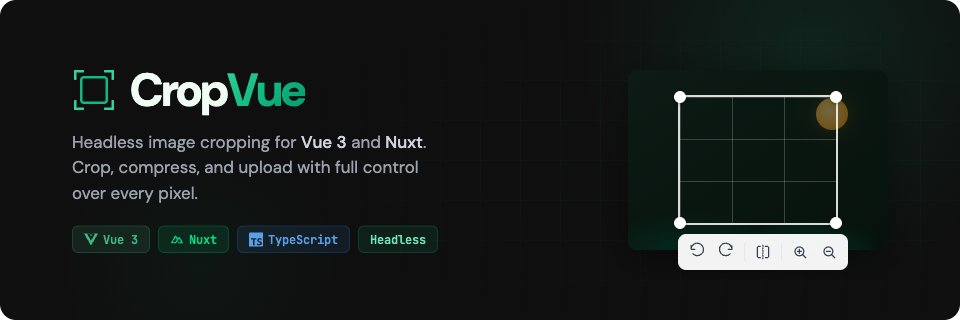

<p align="center">
  
</p>

<p align="center">
  <a href="https://www.npmjs.com/package/@cropvue/vue"></a>
  <a href="https://github.com/rutbergphilip/cropvue/actions/workflows/ci.yml"></a>
  <a href="https://bundlephobia.com/package/@cropvue/vue"></a>
  <a href="https://opensource.org/licenses/MIT"></a>
  <a href="https://www.npmjs.com/package/@cropvue/vue"></a>
</p>

<p align="center">
  <b>Headless, fully customizable image cropping for Vue 3 and Nuxt.</b><br/>
  File upload, drag & drop, crop, rotate, flip, zoom, compress, and upload &mdash; all in one library.
</p>

---

## Why CropVue?

Most Vue cropping libraries give you a black box. CropVue gives you **complete control**. Every visual element is replaceable through scoped slots. Use the defaults for a zero-config experience, or bring your own UI and let CropVue handle the logic.

- **Zero runtime dependencies** &mdash; pure composables and canvas rendering
- **SSR-safe** &mdash; works with Nuxt out of the box
- **Written in TypeScript** &mdash; full type exports for props, events, results, and composable returns
- **Tree-shakeable** &mdash; import only what you use

Built for real-world use cases: **avatar croppers**, **profile picture editors**, **photo uploaders**, **thumbnail generators**, and **image processing pipelines**.

## Features

| Feature | Description |
|---------|-------------|
| **Headless & renderless** | Replace every visual element with scoped slots |
| **Full image pipeline** | Select, drop, crop, rotate, flip, zoom, compress, upload |
| **Smart compression** | WebP, JPEG, PNG output &mdash; never larger than the original |
| **Three stencil shapes** | Rectangle, circle, and freeform with configurable aspect ratios |
| **Touch & gesture support** | Pinch to zoom, drag to pan, resize handles on mobile and desktop |
| **Image queue** | Batch crop multiple images for gallery uploads |
| **CSS custom properties** | Theme the entire component without touching internal styles |
| **Three-layer theming** | CSS variables, `ui` prop classes, and global theme injection |
| **Nuxt module** | Auto-imported components and composables, SSR handled |
| **v-model support** | Two-way binding for crop results |
| **EXIF orientation** | Auto-corrects rotated photos from mobile cameras |
| **Keyboard accessible** | Arrow keys to pan, +/- to zoom, full keyboard navigation |

## Packages

| Package | Description | Version |
|---------|-------------|---------|
| [`@cropvue/core`](https://www.npmjs.com/package/@cropvue/core) | Headless composables and canvas engine | [](https://www.npmjs.com/package/@cropvue/core) |
| [`@cropvue/vue`](https://www.npmjs.com/package/@cropvue/vue) | Vue 3 renderless components | [](https://www.npmjs.com/package/@cropvue/vue) |
| [`@cropvue/nuxt`](https://www.npmjs.com/package/@cropvue/nuxt) | Nuxt module with auto-imports | [](https://www.npmjs.com/package/@cropvue/nuxt) |

## Quick Start

### Installation

```sh
# npm
npm install @cropvue/vue

# yarn
yarn add @cropvue/vue

# pnpm
pnpm add @cropvue/vue
```

### Basic Usage

```vue
<script setup>
import { CropVue } from '@cropvue/vue'
import '@cropvue/vue/styles'

function handleDone(result) {
  console.log(result.blob)   // Cropped Blob
  console.log(result.file)   // File object ready for upload
  console.log(result.url)    // Object URL for preview
  console.log(result.coords) // Exact crop coordinates
}
</script>

<template>
  <CropVue :aspect-ratio="1" stencil="circle" @done="handleDone" />
</template>
```

That gives you a drag-and-drop zone, a crop editor with toolbar, and a result preview. All with sensible defaults.

## Examples

### Avatar / Profile Picture Cropper

```vue
<script setup>
import { CropVue } from '@cropvue/vue'
import '@cropvue/vue/styles'

async function uploadAvatar(file, { onProgress, signal }) {
  const form = new FormData()
  form.append('avatar', file)
  const res = await fetch('/api/avatar', {
    method: 'POST',
    body: form,
    signal,
  })
  return res.json()
}
</script>

<template>
  <CropVue
    stencil="circle"
    :aspect-ratio="1"
    :output-max-width="512"
    :output-max-height="512"
    output-format="webp"
    :upload="uploadAvatar"
    @uploaded="(res) => console.log('Uploaded:', res)"
    @error="(err) => console.error(err)"
  />
</template>
```

### v-model Support

```vue
<script setup>
import { ref } from 'vue'
import { CropVue } from '@cropvue/vue'
import '@cropvue/vue/styles'

const cropResult = ref(null)
</script>

<template>
  <CropVue v-model="cropResult" stencil="rectangle" :aspect-ratio="4 / 3" />
  
</template>
```

### Load Image from URL

```vue
<CropVue src="https://example.com/photo.jpg" @done="handleDone" />
```

### Custom UI with Scoped Slots

Every part of the component is slottable. Build your own crop interface while CropVue handles all the logic:

```vue
<template>
  <CropVue :aspect-ratio="16 / 9" stencil="rectangle">
    <template #dropzone="{ open, isDragging }">
      <div
        :class="['my-dropzone', { active: isDragging }]"
        @click="open"
      >
        Click or drag an image here
      </div>
    </template>

    <template #toolbar="{ rotateLeft, rotateRight, flipX, zoomIn, zoomOut, reset }">
      <div class="my-toolbar">
        <button @click="rotateLeft">Rotate Left</button>
        <button @click="rotateRight">Rotate Right</button>
        <button @click="flipX">Mirror</button>
        <button @click="zoomIn">+</button>
        <button @click="zoomOut">-</button>
        <button @click="reset">Reset</button>
      </div>
    </template>

    <template #actions="{ confirm, cancel }">
      <button @click="cancel">Back</button>
      <button @click="confirm">Save Crop</button>
    </template>

    <template #done="{ result, reedit, remove }">
      
      <button @click="reedit">Edit Again</button>
      <button @click="remove">Delete</button>
    </template>
  </CropVue>
</template>
```

### Restricting File Input

```vue
<CropVue
  :accept="['image/png', 'image/jpeg', 'image/webp']"
  :max-file-size="5 * 1024 * 1024"
  @error="handleError"
/>
```

## Components

### `CropVue`

The all-in-one component. Combines dropzone, editor, toolbar, preview, and upload into a single tag with three phases: **dropzone** → **editor** → **done**.

| Slot | Scoped Props | Description |
|------|-------------|-------------|
| `dropzone` | `open`, `isDragging` | File selection area |
| `dropzone-content` | `open`, `isDragging` | Inner content of the default dropzone |
| `editor` | `image`, `transform`, `crop`, `rotateLeft`, `rotateRight`, `flipX`, `flipY`, `zoomIn`, `zoomOut`, `reset`, `confirm`, `cancel`, `remove` | Full editor replacement |
| `toolbar` | `rotateLeft`, `rotateRight`, `flipX`, `flipY`, `zoomIn`, `zoomOut`, `reset`, `transform` | Toolbar controls |
| `preview` | `image`, `transform`, `crop` | Live crop preview |
| `actions` | `confirm`, `cancel`, `remove`, `isUploading`, `progress` | Confirm/cancel buttons |
| `done` | `result`, `restart`, `reedit`, `remove` | Post-crop result view |
| `error` | &mdash; | Error display area |
| `loading` | `progress` | Upload progress indicator |

### `CropEditor`

The interactive crop canvas. Handles pan, zoom, resize handles, stencil rendering, and pointer/touch/keyboard input.

| Slot | Scoped Props | Description |
|------|-------------|-------------|
| `image` | `style`, `image`, `transform` | Custom image rendering |
| `overlay` | `crop`, `clipPath` | Custom overlay (dark mask outside crop) |
| `crop-area` | `crop`, `style` | Custom crop area |
| `grid` | `crop` | Rule-of-thirds grid |
| `handles` | `crop` | Resize handles |

### `CropDropzone`

Drag-and-drop file input with validation.

| Slot | Scoped Props |
|------|-------------|
| default | `open`, `isDragging` |

### `CropToolbar`

Rotate, flip, zoom, and reset controls.

### `CropPreview`

Live preview of the current crop area rendered on a canvas.

### `CropQueue`

Multi-image batch cropping queue with thumbnails.

| Slot | Scoped Props |
|------|-------------|
| default | `items`, `currentIndex`, `select`, `remove`, `add` |

### `CropStencil`

The crop overlay shape (rectangle, circle, or freeform).

## Props

All props for the `CropVue` component:

| Prop | Type | Default | Description |
|------|------|---------|-------------|
| `stencil` | `'rectangle' \| 'circle' \| 'freeform'` | `'rectangle'` | Shape of the crop area |
| `aspectRatio` | `number \| null` | `null` | Fixed aspect ratio (e.g. `1` for square, `16/9` for widescreen) |
| `minWidth` | `number` | `0` | Minimum crop width in pixels |
| `minHeight` | `number` | `0` | Minimum crop height in pixels |
| `maxWidth` | `number` | `Infinity` | Maximum crop width in pixels |
| `maxHeight` | `number` | `Infinity` | Maximum crop height in pixels |
| `outputFormat` | `'auto' \| 'webp' \| 'jpeg' \| 'png'` | `'auto'` | Output image format. `auto` picks the best format based on input. |
| `outputQuality` | `number` | `0.85` | Compression quality from 0 to 1 |
| `outputMaxWidth` | `number` | &mdash; | Maximum pixel width of the output |
| `outputMaxHeight` | `number` | &mdash; | Maximum pixel height of the output |
| `accept` | `string[]` | `['image/*']` | Accepted file MIME types |
| `maxFileSize` | `number` | `Infinity` | Maximum file size in bytes |
| `multiple` | `boolean` | `false` | Allow selecting multiple files |
| `upload` | `UploadFn \| null` | `null` | Custom upload handler function |
| `src` | `string \| null` | `null` | Load image from URL instead of file picker |
| `modelValue` | `CropResult \| null` | `null` | v-model binding for crop result |
| `pannable` | `boolean` | `true` | Enable panning in the editor |
| `mode` | `'classic' \| 'static' \| 'hybrid'` | `'classic'` | Cropper interaction mode |
| `moveImage` | `boolean \| MoveImageConfig` | `true` | Enable image dragging |
| `resizeImage` | `boolean \| ResizeImageConfig` | `true` | Enable image zoom/resize |
| `transitions` | `boolean` | `true` | Animate transform changes |
| `handlers` | `HandlersConfig` | all enabled | Which resize handles to show |
| `checkOrientation` | `boolean` | `true` | Auto-correct EXIF orientation |
| `ui` | `CropVueUI` | &mdash; | CSS class overrides for theming |

## Events

| Event | Payload | Description |
|-------|---------|-------------|
| `@ready` | `{ width, height }` | Image loaded and ready for cropping |
| `@change` | `{ x, y, width, height }` | Crop area changed (fires on every move) |
| `@done` | `CropResult` | Crop confirmed |
| `@cancel` | &mdash; | User cancelled editing |
| `@remove` | &mdash; | User removed the image |
| `@uploaded` | `unknown` | Upload completed successfully |
| `@error` | `CropVueError` | Something went wrong |
| `@queue-change` | `QueueItem[]` | Queue items changed (multiple mode) |
| `@update:modelValue` | `CropResult \| null` | v-model update |

### CropResult

```ts
interface CropResult {
  blob: Blob              // The cropped image as a Blob
  file: File              // A File object ready for FormData upload
  url: string             // Object URL for  preview
  coords: CropCoordinates // Exact crop position and transforms
  width: number           // Output pixel width
  height: number          // Output pixel height
  originalWidth: number   // Source image width
  originalHeight: number  // Source image height
}

interface CropCoordinates {
  x: number
  y: number
  width: number
  height: number
  rotation: number
  flipX: boolean
  flipY: boolean
  scale: number
}
```

### Error Types

```ts
type CropVueError =
  | { type: 'file-too-large'; maxSize: number; actualSize: number }
  | { type: 'invalid-type'; accepted: string[]; actual: string }
  | { type: 'load-failed'; message: string }
  | { type: 'canvas-limit'; maxDimension: number }
  | { type: 'upload-failed'; message: string }
  | { type: 'compress-failed'; message: string }
```

## Headless Composable API

For full control without any built-in components, use the composables directly from `@cropvue/core`:

### `useCropper`

```ts
import { useCropper } from '@cropvue/core'

const cropper = useCropper({
  stencil: 'rectangle',
  aspectRatio: 16 / 9,
  outputFormat: 'webp',
  outputQuality: 0.85,
  outputMaxWidth: 1920,
})

// Load an image
await cropper.loadFile(file)
await cropper.loadUrl('https://example.com/photo.jpg')

// Transform
cropper.rotateLeft()        // -90 degrees
cropper.rotateRight()       // +90 degrees
cropper.rotateTo(45)        // Exact angle
cropper.flipX()             // Horizontal mirror
cropper.flipY()             // Vertical mirror
cropper.zoomBy(0.2)         // Relative zoom
cropper.zoomTo(1.5)         // Absolute zoom
cropper.panTo(100, 50)      // Set pan position
cropper.reset()             // Reset all transforms

// Change crop area
cropper.setStencil('circle')
cropper.setAspectRatio(1)
cropper.setCropArea({ x: 0, y: 0, width: 500, height: 500 })

// Get the result
const result = await cropper.getResult()
// result.blob   - Cropped Blob
// result.file   - File ready for upload
// result.url    - Object URL for preview
// result.coords - Crop coordinates and transforms
// result.width  - Output width
// result.height - Output height
```

#### Returned Refs and Methods

| Ref / Method | Type | Description |
|-------------|------|-------------|
| `image` | `Ref<ImageData \| null>` | Loaded image data |
| `transform` | `Ref<TransformState>` | Current transform (position, scale, rotation, flip) |
| `crop` | `Ref<CropState>` | Current crop area |
| `isReady` | `Ref<boolean>` | Whether an image is loaded |
| `isTransitioning` | `Ref<boolean>` | Whether a transition animation is active |
| `loadFile(file)` | `(File) => Promise<void>` | Load image from File |
| `loadUrl(url)` | `(string) => Promise<void>` | Load image from URL |
| `rotateLeft()` | `() => void` | Rotate 90 degrees counter-clockwise |
| `rotateRight()` | `() => void` | Rotate 90 degrees clockwise |
| `rotateTo(deg)` | `(number) => void` | Set exact rotation angle |
| `flipX()` | `() => void` | Flip horizontally |
| `flipY()` | `() => void` | Flip vertically |
| `zoomTo(scale)` | `(number) => void` | Set absolute zoom level |
| `zoomBy(delta)` | `(number) => void` | Adjust zoom relatively |
| `panTo(x, y)` | `(number, number) => void` | Set pan position |
| `reset()` | `() => void` | Reset all transforms |
| `setCropArea(area)` | `(Partial<CropState>) => void` | Update crop area |
| `setStencil(type)` | `(StencilType) => void` | Change stencil shape |
| `setAspectRatio(r)` | `(number \| null) => void` | Change aspect ratio |
| `getResult(opts?)` | `() => Promise<CropResult>` | Export cropped image |
| `renderToCanvas()` | `() => void` | Render current crop to bound canvas |

### `useDropzone`

Drag-and-drop file handling with validation:

```ts
import { useDropzone } from '@cropvue/core'

const { isDragging, files, dropzoneRef, open } = useDropzone({
  accept: ['image/png', 'image/jpeg'],
  maxSize: 10 * 1024 * 1024, // 10 MB
  multiple: false,
  onFiles: (files) => console.log('Selected:', files),
  onError: (err) => console.error(err),
})
```

### `useImageQueue`

Batch image processing queue:

```ts
import { useImageQueue } from '@cropvue/core'

const queue = useImageQueue()

queue.add(file)             // Add a file to the queue
queue.remove(index)         // Remove by index
queue.select(index)         // Set active item
queue.setResult(index, result) // Store crop result for an item
// queue.images            - Ref<QueueItem[]>
// queue.current           - Ref<number> (active index)
// queue.results           - Computed<CropResult[]>
```

### `useUploader`

File upload with progress tracking:

```ts
import { useUploader } from '@cropvue/core'

const uploader = useUploader({
  url: '/api/upload',
  fieldName: 'image',
  headers: { Authorization: 'Bearer ...' },
})

await uploader.upload(file)
// uploader.isUploading  - Ref<boolean>
// uploader.progress     - Ref<number> (0-100)
// uploader.error        - Ref<string | null>
// uploader.abort()      - Cancel in-flight upload
```

### `useCompressor`

Image compression and format conversion:

```ts
import { useCompressor } from '@cropvue/core'

const compressor = useCompressor()

const blob = await compressor.compress(canvas, {
  format: 'webp',
  quality: 0.8,
})
// compressor.isCompressing - Ref<boolean>
```

## Stencil Shapes

Three built-in crop shapes:

- **`rectangle`** &mdash; Standard rectangular crop. Any aspect ratio or unconstrained.
- **`circle`** &mdash; Circular crop with enforced 1:1 ratio. Perfect for avatars and profile pictures.
- **`freeform`** &mdash; Custom polygon crop path for non-rectangular selections.

```vue
<!-- Square avatar -->
<CropVue stencil="circle" :aspect-ratio="1" />

<!-- Widescreen banner -->
<CropVue stencil="rectangle" :aspect-ratio="16 / 9" />

<!-- Free crop -->
<CropVue stencil="rectangle" />
```

## Output & Compression

| Option | Type | Default | Description |
|--------|------|---------|-------------|
| `outputFormat` | `'auto' \| 'webp' \| 'jpeg' \| 'png'` | `'auto'` | `auto` preserves alpha for transparent inputs, otherwise picks the smallest format |
| `outputQuality` | `number` | `0.85` | Compression quality from 0 to 1 |
| `outputMaxWidth` | `number` | &mdash; | Max output width in pixels |
| `outputMaxHeight` | `number` | &mdash; | Max output height in pixels |

The compression engine guarantees the output is **never larger than the original file**. If the compressed result exceeds the input size, it automatically returns the smaller version.

## Theming

CropVue offers three layers of theming, from simplest to most powerful.

### Layer 1: CSS Custom Properties

Style everything through CSS variables scoped to `.cropvue`:

```css
.cropvue {
  --cropvue-max-width: 600px;

  /* Editor */
  --cropvue-editor-bg: #1a1a1a;
  --cropvue-editor-aspect-ratio: 4 / 3;
  --cropvue-editor-border-radius: 12px;

  /* Overlay */
  --cropvue-overlay-color: rgba(0, 0, 0, 0.6);

  /* Crop area */
  --cropvue-crop-border-color: #fff;
  --cropvue-crop-border-width: 2px;

  /* Grid */
  --cropvue-grid-color: rgba(255, 255, 255, 0.3);
  --cropvue-grid-display: block; /* set to 'none' to hide */

  /* Handles */
  --cropvue-handle-color: #fff;
  --cropvue-handle-size: 10px;
  --cropvue-handle-border-radius: 50%;

  /* Dropzone */
  --cropvue-dropzone-border-color: #e5e7eb;
  --cropvue-dropzone-border-color-active: #3b82f6;
  --cropvue-dropzone-bg: #fafafa;
  --cropvue-dropzone-bg-active: rgba(59, 130, 246, 0.05);
  --cropvue-dropzone-border-radius: 12px;

  /* Toolbar */
  --cropvue-toolbar-bg: #fff;
  --cropvue-toolbar-btn-size: 36px;
  --cropvue-toolbar-border-radius: 8px;

  /* Buttons */
  --cropvue-btn-padding: 8px 20px;
  --cropvue-btn-radius: 6px;
  --cropvue-btn-confirm-bg: #3b82f6;
  --cropvue-btn-confirm-hover-bg: #2563eb;

  /* Queue */
  --cropvue-queue-thumb-size: 64px;
  --cropvue-queue-active-border: #3b82f6;

  /* Preview */
  --cropvue-preview-border-radius: 8px;
}
```

<details>
<summary><strong>All CSS variables</strong></summary>

#### Component

| Variable | Default |
|----------|---------|
| `--cropvue-max-width` | `none` |

#### Editor

| Variable | Default |
|----------|---------|
| `--cropvue-editor-bg` | `#1a1a1a` |
| `--cropvue-editor-height` | `auto` |
| `--cropvue-editor-aspect-ratio` | `4 / 3` |
| `--cropvue-editor-max-height` | `none` |
| `--cropvue-editor-min-height` | `120px` |
| `--cropvue-editor-border-radius` | `0` |

#### Overlay

| Variable | Default |
|----------|---------|
| `--cropvue-overlay-color` | `rgba(0, 0, 0, 0.5)` |
| `--cropvue-overlay-transition` | `150ms ease` |

#### Crop Area

| Variable | Default |
|----------|---------|
| `--cropvue-crop-border-color` | `#fff` |
| `--cropvue-crop-border-width` | `2px` |
| `--cropvue-crop-border-style` | `solid` |

#### Grid

| Variable | Default |
|----------|---------|
| `--cropvue-grid-color` | `rgba(255, 255, 255, 0.3)` |
| `--cropvue-grid-width` | `1px` |
| `--cropvue-grid-display` | `block` |

#### Handles

| Variable | Default |
|----------|---------|
| `--cropvue-handle-color` | `#fff` |
| `--cropvue-handle-size` | `10px` |
| `--cropvue-handle-border-radius` | `50%` |

#### Dropzone

| Variable | Default |
|----------|---------|
| `--cropvue-dropzone-border-color` | `#d1d5db` |
| `--cropvue-dropzone-border-color-active` | `#3b82f6` |
| `--cropvue-dropzone-bg` | `transparent` |
| `--cropvue-dropzone-bg-active` | `rgba(59, 130, 246, 0.05)` |
| `--cropvue-dropzone-border-style` | `dashed` |
| `--cropvue-dropzone-border-radius` | `8px` |

#### Toolbar

| Variable | Default |
|----------|---------|
| `--cropvue-toolbar-bg` | `#fff` |
| `--cropvue-toolbar-btn-size` | `36px` |
| `--cropvue-toolbar-padding` | `8px` |
| `--cropvue-toolbar-gap` | `4px` |
| `--cropvue-toolbar-separator-height` | `20px` |
| `--cropvue-toolbar-border-radius` | `8px` |
| `--cropvue-toolbar-border-color` | `#e5e7eb` |
| `--cropvue-toolbar-btn-color` | `#374151` |
| `--cropvue-toolbar-btn-hover-bg` | `#f3f4f6` |
| `--cropvue-toolbar-btn-hover-color` | `#111827` |
| `--cropvue-toolbar-btn-active-bg` | `#e5e7eb` |
| `--cropvue-toolbar-btn-radius` | `6px` |
| `--cropvue-toolbar-separator-color` | `#e5e7eb` |
| `--cropvue-toolbar-separator-display` | `block` |

#### Buttons

| Variable | Default |
|----------|---------|
| `--cropvue-btn-padding` | `8px 20px` |
| `--cropvue-btn-font-size` | `14px` |
| `--cropvue-btn-bg` | `#fff` |
| `--cropvue-btn-color` | `#374151` |
| `--cropvue-btn-border-color` | `#d1d5db` |
| `--cropvue-btn-radius` | `6px` |
| `--cropvue-btn-hover-bg` | `#f9fafb` |
| `--cropvue-btn-confirm-bg` | `#3b82f6` |
| `--cropvue-btn-confirm-color` | `#fff` |
| `--cropvue-btn-confirm-border` | `#3b82f6` |
| `--cropvue-btn-confirm-hover-bg` | `#2563eb` |

#### Actions

| Variable | Default |
|----------|---------|
| `--cropvue-actions-gap` | `8px` |
| `--cropvue-actions-padding` | `12px 0` |

#### Queue

| Variable | Default |
|----------|---------|
| `--cropvue-queue-thumb-size` | `64px` |
| `--cropvue-queue-thumb-radius` | `6px` |
| `--cropvue-queue-active-border` | `#3b82f6` |
| `--cropvue-queue-check-bg` | `#22c55e` |

#### Stencil

| Variable | Default |
|----------|---------|
| `--cropvue-stencil-bg` | `transparent` |
| `--cropvue-stencil-border` | `none` |

#### Preview

| Variable | Default |
|----------|---------|
| `--cropvue-preview-border-radius` | `0` |
| `--cropvue-preview-bg` | `transparent` |

</details>

### Layer 2: `ui` Prop (Class Overrides)

Pass CSS classes directly to internal elements via the `ui` prop. Works with Tailwind CSS, UnoCSS, or any class-based styling:

```vue
<CropVue
  :ui="{
    root: 'rounded-xl shadow-lg',
    dropzone: 'border-2 border-dashed border-blue-300 bg-blue-50',
    dropzoneActive: 'border-blue-500 bg-blue-100',
    confirmButton: 'bg-green-600 hover:bg-green-700 text-white',
    cancelButton: 'bg-gray-200 hover:bg-gray-300',
  }"
/>
```

Each component accepts its own `ui` prop:

| Component | UI Interface | Slots |
|-----------|-------------|-------|
| `CropVue` | `CropVueUI` | `root`, `dropzone`, `dropzoneActive`, `actions`, `cancelButton`, `confirmButton`, `done`, `resultImage` |
| `CropEditor` | `CropEditorUI` | `root`, `viewport`, `image`, `overlay`, `cropArea`, `grid`, `gridLine`, `handle` |
| `CropToolbar` | `CropToolbarUI` | `root`, `default`, `button`, `separator` |
| `CropDropzone` | `CropDropzoneUI` | `root`, `default` |
| `CropPreview` | `CropPreviewUI` | `root`, `canvas` |
| `CropQueue` | `CropQueueUI` | `root`, `list`, `item`, `itemActive`, `itemDone`, `thumbnail`, `removeButton`, `checkIcon` |
| `CropStencil` | `CropStencilUI` | `root`, `shape` |

### Layer 3: Global Theme (Vue Plugin)

Apply consistent styling across all CropVue instances in your app:

```ts
import { createApp } from 'vue'
import { createCropVueTheme } from '@cropvue/vue'

const app = createApp(App)

app.use(createCropVueTheme({
  CropVue: {
    root: 'my-cropper',
    confirmButton: 'btn btn-primary',
    cancelButton: 'btn btn-secondary',
  },
  CropEditor: {
    root: 'editor-custom',
    handle: 'handle-custom',
  },
  // Optional: Tailwind Merge or clsx for class merging
  merger: (...classes) => classes.filter(Boolean).join(' '),
}))
```

When using Tailwind CSS, install [`tailwind-merge`](https://www.npmjs.com/package/tailwind-merge) (optional peer dependency) for automatic class conflict resolution.

## Upload Handler

Pass a custom `upload` function to handle file uploads after cropping:

```ts
const uploadFn: UploadFn = async (file, { onProgress, signal }) => {
  const form = new FormData()
  form.append('image', file)

  const xhr = new XMLHttpRequest()
  xhr.open('POST', '/api/upload')

  // Progress tracking
  xhr.upload.onprogress = (e) => {
    if (e.lengthComputable) onProgress((e.loaded / e.total) * 100)
  }

  // Abort support
  signal.addEventListener('abort', () => xhr.abort())

  return new Promise((resolve, reject) => {
    xhr.onload = () => resolve(JSON.parse(xhr.response))
    xhr.onerror = () => reject(new Error('Upload failed'))
    xhr.send(form)
  })
}
```

```vue
<CropVue :upload="uploadFn" @uploaded="onUploaded" @error="onError" />
```

## Nuxt

```ts
// nuxt.config.ts
export default defineNuxtConfig({
  modules: ['@cropvue/nuxt'],
})
```

All components (`CropVue`, `CropEditor`, `CropDropzone`, `CropToolbar`, `CropPreview`, `CropQueue`, `CropStencil`) and composables (`useCropper`, `useDropzone`, `useImageQueue`, `useUploader`, `useCompressor`) are auto-imported. No manual imports needed. SSR is handled automatically.

```vue
<!-- No imports needed in Nuxt -->
<template>
  <CropVue stencil="circle" :aspect-ratio="1" @done="handleDone" />
</template>
```

## Accessing the Component Instance

Use template refs to access the cropper programmatically:

```vue
<script setup>
import { ref } from 'vue'

const cropperRef = ref()

function confirmProgrammatically() {
  cropperRef.value?.confirm()
}

function getCurrentPhase() {
  return cropperRef.value?.phase // 'dropzone' | 'editor' | 'done'
}
</script>

<template>
  <CropVue ref="cropperRef" />
  <button @click="confirmProgrammatically">Confirm</button>
</template>
```

Exposed properties: `cropper`, `phase`, `confirm()`, `cancel()`, `restart()`, `reedit()`, `remove()`, `result`.

## Browser Support

Works in all modern browsers that support the [Canvas API](https://developer.mozilla.org/en-US/docs/Web/API/Canvas_API):

| Browser | Version |
|---------|---------|
| Chrome | 60+ |
| Firefox | 55+ |
| Safari | 11+ |
| Edge | 79+ |
| Mobile Safari | 11+ |
| Chrome Android | 60+ |

Touch gestures (pinch-to-zoom, drag-to-pan) are fully supported on mobile devices.

## TypeScript

CropVue is written in TypeScript and exports all types:

```ts
import type {
  CropResult,
  CropCoordinates,
  CropState,
  TransformState,
  StencilType,
  OutputFormat,
  CropperOptions,
  CropVueError,
  QueueItem,
  UploadFn,
  UploadResult,
  DropzoneOptions,
  UploaderOptions,
  CompressorOptions,
  CropperMode,
  HandlersConfig,
  MoveImageConfig,
  ResizeImageConfig,
  ImageTransforms,
} from '@cropvue/vue' // or '@cropvue/core'

import type {
  CropVueUI,
  CropEditorUI,
  CropToolbarUI,
  CropDropzoneUI,
  CropPreviewUI,
  CropQueueUI,
  CropStencilUI,
  CropVueTheme,
} from '@cropvue/vue'
```

## Development

```sh
git clone https://github.com/rutbergphilip/cropvue.git
cd cropvue
pnpm install
pnpm dev              # Start playground
pnpm build            # Build all packages
pnpm test:run         # Run unit tests (542 tests, 100% line coverage)
pnpm typecheck        # Type check all packages
```

## Contributing

Contributions are welcome. Please [open an issue](https://github.com/rutbergphilip/cropvue/issues) first to discuss what you'd like to change.

## License

[MIT](./LICENSE) &copy; [Philip Rutberg](https://github.com/rutbergphilip)
